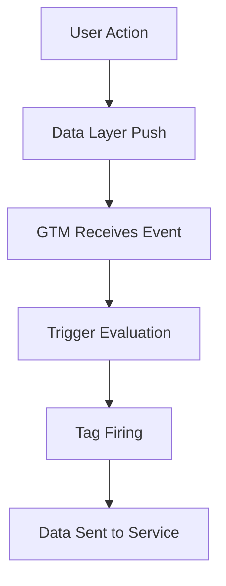

# نظام Google Tag Manager (GTM) - دليل شامل ومفصل

## 📋 جدول المحتويات

1. [مقدمة عن Google Tag Manager](#مقدمة-عن-google-tag-manager)
2. [المفاهيم الأساسية](#المفاهيم-الأساسية)
3. [الهيكل التقني للـ GTM](#الهيكل-التقني-للـ-gtm)
4. [التنفيذ في Next.js](#التنفيذ-في-nextjs)
5. [نظام التتبع المتقدم](#نظام-التتبع-المتقدم)
6. [أفضل الممارسات](#أفضل-الممارسات)
7. [استكشاف الأخطاء وإصلاحها](#استكشاف-الأخطاء-وإصلاحها)
8. [الأمثلة العملية](#الأمثلة-العملية)

---

## مقدمة عن Google Tag Manager

### ما هو Google Tag Manager؟

Google Tag Manager (GTM) هو نظام إدارة العلامات (Tags) من Google الذي يسمح بإدارة وتتبع جميع أدوات التسويق والتحليلات من مكان واحد دون الحاجة لتعديل الكود مباشرة.

### المزايا الرئيسية:

- **إدارة مركزية**: جميع العلامات في مكان واحد
- **سرعة التطوير**: لا حاجة لتعديل الكود عند إضافة تتبع جديد
- **المرونة**: إضافة/إزالة العلامات بسهولة
- **التحكم في الأداء**: تحميل العلامات حسب الحاجة
- **التنفيذ السريع**: نشر التغييرات فوراً

---

## المفاهيم الأساسية

### 1. Container (الحاوية)

```javascript
// معرف الحاوية
const CONTAINER_ID = "GTM-KBL37C9T";
```

الحاوية هي المكان الذي يحتوي على جميع العلامات والقواعد والمتغيرات.

### 2. Tags (العلامات)

العلامات هي أجزاء من الكود JavaScript التي ترسل البيانات إلى خدمات خارجية:

- Google Analytics
- Facebook Pixel
- Google Ads
- Custom HTML

### 3. Triggers (المشغلات)

المشغلات تحدد متى يتم تشغيل العلامات:

- Page View (عرض الصفحة)
- Click (النقر)
- Form Submit (إرسال النموذج)
- Custom Event (حدث مخصص)

### 4. Variables (المتغيرات)

المتغيرات تخزن البيانات التي يمكن استخدامها في العلامات والمشغلات:

- Built-in Variables (متغيرات مدمجة)
- Custom Variables (متغيرات مخصصة)
- Data Layer Variables (متغيرات طبقة البيانات)

### 5. Data Layer (طبقة البيانات)

```javascript
// مثال على Data Layer
window.dataLayer = window.dataLayer || [];
window.dataLayer.push({
  event: "purchase",
  ecommerce: {
    transaction_id: "12345",
    value: 25.42,
    currency: "USD",
    items: [
      {
        item_id: "SKU123",
        item_name: "Product Name",
        category: "Category",
        quantity: 1,
        price: 25.42,
      },
    ],
  },
});
```

---

## الهيكل التقني للـ GTM

### 1. GTM Script Loading

```html
<!-- GTM Script في <head> -->
<script>
  (function (w, d, s, l, i) {
    w[l] = w[l] || [];
    w[l].push({ "gtm.start": new Date().getTime(), event: "gtm.js" });
    var f = d.getElementsByTagName(s)[0],
      j = d.createElement(s),
      dl = l != "dataLayer" ? "&l=" + l : "";
    j.async = true;
    j.src = "https://www.googletagmanager.com/gtm.js?id=" + i + dl;
    f.parentNode.insertBefore(j, f);
  })(window, document, "script", "dataLayer", "GTM-KBL37C9T");
</script>

<!-- GTM NoScript في <body> -->
<noscript>
  <iframe
    src="https://www.googletagmanager.com/ns.html?id=GTM-KBL37C9T"
    height="0"
    width="0"
    style="display:none;visibility:hidden"
  ></iframe>
</noscript>
```

### 2. Data Layer Structure

```javascript
// البنية الأساسية للـ Data Layer
window.dataLayer = [
  {
    event: "gtm.js",
    "gtm.start": 1234567890123,
  },
  {
    event: "page_view",
    page_title: "Home Page",
    page_location: "https://example.com",
    page_path: "/",
  },
];
```

### 3. Event Tracking Flow



---

## التنفيذ في Next.js

### 1. Root Layout Implementation

```typescript
// app/layout.tsx
import Script from "next/script";

export default function RootLayout({ children }: { children: React.ReactNode }) {
  return (
    <html lang="ar" dir="ltr">
      <head>
        {/* GTM Script */}
        <Script
          id="gtm-script"
          strategy="afterInteractive"
          dangerouslySetInnerHTML={{
            __html: `
              (function(w,d,s,l,i){w[l]=w[l]||[];w[l].push({'gtm.start':
              new Date().getTime(),event:'gtm.js'});var f=d.getElementsByTagName(s)[0],
              j=d.createElement(s),dl=l!='dataLayer'?'&l='+l:'';j.async=true;j.src=
              'https://www.googletagmanager.com/gtm.js?id='+i+dl;f.parentNode.insertBefore(j,f);
              })(window,document,'script','dataLayer','GTM-KBL37C9T');
            `,
          }}
        />
      </head>
      <body>
        {/* GTM NoScript */}
        <noscript>
          <iframe
            src="https://www.googletagmanager.com/ns.html?id=GTM-KBL37C9T"
            height="0"
            width="0"
            style={{ display: "none", visibility: "hidden" }}
          />
        </noscript>
        {children}
      </body>
    </html>
  );
}
```

### 2. GTM Provider Component

```typescript
// components/GTMProvider.tsx
"use client";

import { useEffect } from "react";
import { usePathname, useSearchParams } from "next/navigation";
import Script from "next/script";

interface GTMProviderProps {
  children: React.ReactNode;
  containerId: string;
}

export function GTMProvider({ children, containerId }: GTMProviderProps) {
  const pathname = usePathname();
  const searchParams = useSearchParams();

  // Initialize GTM dataLayer
  useEffect(() => {
    if (typeof window !== "undefined") {
      window.dataLayer = window.dataLayer || [];
      window.gtag = window.gtag || function() {
        window.dataLayer.push(arguments);
      };
    }
  }, []);

  // Track page views on route changes
  useEffect(() => {
    if (typeof window !== "undefined" && window.gtag) {
      const url = pathname + (searchParams.toString() ? `?${searchParams.toString()}` : '');

      window.gtag('config', containerId, {
        page_path: url,
        page_title: document.title,
      });
    }
  }, [pathname, searchParams, containerId]);

  return (
    <>
      {children}
    </>
  );
}
```

### 3. GTM Utility Functions

```typescript
// lib/gtm.ts

// Initialize GTM dataLayer
const initializeGTM = () => {
  if (typeof window !== "undefined") {
    window.dataLayer = window.dataLayer || [];
    window.gtag =
      window.gtag ||
      function () {
        window.dataLayer.push(arguments);
      };
  }
};

// Track custom events
export const trackEvent = (
  eventName: string,
  parameters?: Record<string, any>,
) => {
  initializeGTM();

  if (typeof window !== "undefined" && window.gtag) {
    window.gtag("event", eventName, parameters);
  }
};

// Track page views
export const trackPageView = (pagePath: string, pageTitle?: string) => {
  initializeGTM();

  if (typeof window !== "undefined" && window.gtag) {
    window.gtag("config", "GTM-KBL37C9T", {
      page_path: pagePath,
      page_title: pageTitle || document.title,
    });
  }
};

// Track conversions
export const trackConversion = (
  conversionId: string,
  value?: number,
  currency?: string,
) => {
  initializeGTM();

  if (typeof window !== "undefined" && window.gtag) {
    window.gtag("event", "conversion", {
      send_to: conversionId,
      value: value,
      currency: currency || "USD",
    });
  }
};

// Track e-commerce purchases
export const trackPurchase = (
  transactionId: string,
  value: number,
  currency: string,
  items: any[],
) => {
  initializeGTM();

  if (typeof window !== "undefined" && window.gtag) {
    window.gtag("event", "purchase", {
      transaction_id: transactionId,
      value: value,
      currency: currency,
      items: items,
    });
  }
};

// Track user interactions
export const trackUserInteraction = (
  action: string,
  category: string,
  label?: string,
  value?: number,
) => {
  initializeGTM();

  if (typeof window !== "undefined" && window.gtag) {
    window.gtag("event", action, {
      event_category: category,
      event_label: label,
      value: value,
    });
  }
};
```

---

## نظام التتبع المتقدم

### 1. Enhanced E-commerce Tracking

```typescript
// تتبع متقدم للتجارة الإلكترونية
export const trackEnhancedEcommerce = {
  // تتبع عرض المنتج
  viewItem: (item: {
    item_id: string;
    item_name: string;
    item_category: string;
    item_category2?: string;
    price: number;
    currency: string;
  }) => {
    trackEvent("view_item", {
      currency: item.currency,
      value: item.price,
      items: [item],
    });
  },

  // تتبع إضافة المنتج للسلة
  addToCart: (item: any, quantity: number = 1) => {
    trackEvent("add_to_cart", {
      currency: item.currency,
      value: item.price * quantity,
      items: [{ ...item, quantity }],
    });
  },

  // تتبع بدء عملية الدفع
  beginCheckout: (value: number, currency: string, items: any[]) => {
    trackEvent("begin_checkout", {
      currency,
      value,
      items,
    });
  },

  // تتبع إتمام الشراء
  purchase: (
    transactionId: string,
    value: number,
    currency: string,
    items: any[],
  ) => {
    trackEvent("purchase", {
      transaction_id: transactionId,
      currency,
      value,
      items,
    });
  },
};
```

### 2. User Journey Tracking

```typescript
// تتبع رحلة المستخدم
export const trackUserJourney = {
  // تتبع تسجيل الدخول
  login: (method: string) => {
    trackEvent("login", { method });
  },

  // تتبع التسجيل
  signup: (method: string) => {
    trackEvent("sign_up", { method });
  },

  // تتبع البحث
  search: (searchTerm: string, resultsCount?: number) => {
    trackEvent("search", {
      search_term: searchTerm,
      results_count: resultsCount,
    });
  },

  // تتبع التفاعل مع المحتوى
  contentEngagement: (
    contentType: string,
    contentId: string,
    action: string,
  ) => {
    trackEvent("content_engagement", {
      content_type: contentType,
      content_id: contentId,
      engagement_action: action,
    });
  },
};
```

### 3. Performance Tracking

```typescript
// تتبع الأداء
export const trackPerformance = {
  // تتبع سرعة تحميل الصفحة
  pageLoadTime: (loadTime: number) => {
    trackEvent("page_load_time", {
      load_time: loadTime,
      load_time_category:
        loadTime < 1000 ? "fast" : loadTime < 3000 ? "medium" : "slow",
    });
  },

  // تتبع أخطاء JavaScript
  jsError: (errorMessage: string, errorStack?: string) => {
    trackEvent("js_error", {
      error_message: errorMessage,
      error_stack: errorStack,
      error_type: "javascript",
    });
  },

  // تتبع أخطاء الشبكة
  networkError: (url: string, status: number, errorMessage: string) => {
    trackEvent("network_error", {
      error_url: url,
      status_code: status,
      error_message: errorMessage,
    });
  },
};
```

---

## أفضل الممارسات

### 1. Data Layer Best Practices

```typescript
// ✅ ممارسات جيدة للـ Data Layer
const goodDataLayerPush = {
  event: "custom_event",
  event_category: "user_interaction",
  event_action: "button_click",
  event_label: "signup_button",
  value: 1,
  custom_parameter: "additional_data",
};

// ❌ تجنب هذه الممارسات
const badDataLayerPush = {
  event: "", // لا تترك القيم فارغة
  undefined_variable: undefined, // لا تستخدم undefined
  too_much_data: {
    /* كمية كبيرة من البيانات غير الضرورية */
  },
};
```

### 2. Event Naming Conventions

```typescript
// نظام تسمية الأحداث
const eventNaming = {
  // الصيغة: action_object
  click_button: "user_clicked_button",
  view_page: "user_viewed_page",
  submit_form: "user_submitted_form",

  // الصيغة: category_action
  ecommerce_purchase: "user_purchased_item",
  engagement_scroll: "user_scrolled_page",
  navigation_click: "user_clicked_navigation",
};
```

### 3. Performance Optimization

```typescript
// تحسين الأداء
export const optimizedGTM = {
  // تحميل مشروط للعلامات
  loadTagConditionally: (condition: boolean, tagFunction: () => void) => {
    if (condition && typeof window !== "undefined") {
      tagFunction();
    }
  },

  // تأخير تحميل العلامات غير الحرجة
  loadNonCriticalTags: () => {
    setTimeout(() => {
      // تحميل العلامات غير الحرجة بعد 2 ثانية
      trackEvent("delayed_tag_loaded");
    }, 2000);
  },

  // تنظيف البيانات قبل الإرسال
  sanitizeData: (data: any) => {
    return Object.keys(data).reduce((acc, key) => {
      if (data[key] !== null && data[key] !== undefined) {
        acc[key] = data[key];
      }
      return acc;
    }, {} as any);
  },
};
```

---

## استكشاف الأخطاء وإصلاحها

### 1. Common Issues and Solutions

#### مشكلة: GTM لا يتم تحميله

```typescript
// الحل: التحقق من وجود GTM
const checkGTMStatus = () => {
  if (typeof window !== "undefined") {
    console.log("DataLayer exists:", !!window.dataLayer);
    console.log("GTM loaded:", !!window.gtag);
    console.log("Container ID:", "GTM-KBL37C9T");
  }
};
```

#### مشكلة: الأحداث لا يتم تتبعها

```typescript
// الحل: التحقق من صحة البيانات
const validateEventData = (eventData: any) => {
  const requiredFields = ["event"];
  const missingFields = requiredFields.filter((field) => !eventData[field]);

  if (missingFields.length > 0) {
    console.error("Missing required fields:", missingFields);
    return false;
  }

  return true;
};
```

### 2. Debug Tools

```typescript
// أدوات التصحيح
export const GTMDebugger = {
  // طباعة جميع أحداث Data Layer
  logAllEvents: () => {
    if (typeof window !== "undefined" && window.dataLayer) {
      console.log("All DataLayer events:", window.dataLayer);
    }
  },

  // تتبع الأحداث الجديدة
  trackNewEvents: () => {
    if (typeof window !== "undefined") {
      const originalPush = window.dataLayer.push;
      window.dataLayer.push = function (...args) {
        console.log("New DataLayer event:", args);
        return originalPush.apply(this, args);
      };
    }
  },

  // التحقق من حالة GTM
  checkGTMStatus: () => {
    return {
      dataLayerExists: typeof window !== "undefined" && !!window.dataLayer,
      gtagExists: typeof window !== "undefined" && !!window.gtag,
      containerId: "GTM-KBL37C9T",
      eventsCount:
        typeof window !== "undefined" ? window.dataLayer?.length || 0 : 0,
    };
  },
};
```

### 3. Testing Strategies

```typescript
// استراتيجيات الاختبار
export const GTMTesting = {
  // اختبار الأحداث
  testEvent: (eventName: string, data: any) => {
    console.log(`Testing event: ${eventName}`, data);
    trackEvent(eventName, data);
  },

  // اختبار تتبع الصفحات
  testPageView: (path: string, title: string) => {
    console.log(`Testing page view: ${path} - ${title}`);
    trackPageView(path, title);
  },

  // اختبار التتبع المتقدم
  testAdvancedTracking: () => {
    // اختبار تتبع التجارة الإلكترونية
    trackEnhancedEcommerce.viewItem({
      item_id: "test_item",
      item_name: "Test Product",
      item_category: "Test Category",
      price: 99.99,
      currency: "USD",
    });

    // اختبار تتبع رحلة المستخدم
    trackUserJourney.login("email");
    trackUserJourney.signup("google");
  },
};
```

---

## الأمثلة العملية

### 1. E-commerce Website Tracking

```typescript
// تتبع موقع تجارة إلكترونية
export const ecommerceTracking = {
  // عند عرض المنتج
  onProductView: (product: any) => {
    trackEnhancedEcommerce.viewItem({
      item_id: product.id,
      item_name: product.name,
      item_category: product.category,
      price: product.price,
      currency: "USD",
    });
  },

  // عند إضافة المنتج للسلة
  onAddToCart: (product: any, quantity: number) => {
    trackEnhancedEcommerce.addToCart(product, quantity);
  },

  // عند بدء عملية الدفع
  onBeginCheckout: (cartItems: any[], totalValue: number) => {
    trackEnhancedEcommerce.beginCheckout(totalValue, "USD", cartItems);
  },

  // عند إتمام الشراء
  onPurchase: (order: any) => {
    trackEnhancedEcommerce.purchase(
      order.transactionId,
      order.totalValue,
      "USD",
      order.items,
    );
  },
};
```

### 2. SaaS Application Tracking

```typescript
// تتبع تطبيق SaaS
export const saasTracking = {
  // تتبع تسجيل الدخول
  onUserLogin: (userId: string, loginMethod: string) => {
    trackUserJourney.login(loginMethod);
    trackEvent("user_login", {
      user_id: userId,
      login_method: loginMethod,
    });
  },

  // تتبع إنشاء الحساب
  onAccountCreation: (userId: string, plan: string) => {
    trackUserJourney.signup("email");
    trackEvent("account_created", {
      user_id: userId,
      plan_type: plan,
    });
  },

  // تتبع استخدام الميزات
  onFeatureUsage: (featureName: string, userId: string) => {
    trackEvent("feature_used", {
      feature_name: featureName,
      user_id: userId,
    });
  },

  // تتبع الاشتراك
  onSubscription: (userId: string, plan: string, value: number) => {
    trackEvent("subscription_created", {
      user_id: userId,
      plan_type: plan,
      value: value,
      currency: "USD",
    });
  },
};
```

### 3. Content Website Tracking

```typescript
// تتبع موقع المحتوى
export const contentTracking = {
  // تتبع قراءة المقال
  onArticleRead: (
    articleId: string,
    articleTitle: string,
    readTime: number,
  ) => {
    trackEvent("article_read", {
      article_id: articleId,
      article_title: articleTitle,
      read_time: readTime,
    });
  },

  // تتبع مشاركة المحتوى
  onContentShare: (contentId: string, sharePlatform: string) => {
    trackEvent("content_shared", {
      content_id: contentId,
      share_platform: sharePlatform,
    });
  },

  // تتبع الاشتراك في النشرة
  onNewsletterSubscribe: (email: string) => {
    trackEvent("newsletter_subscribe", {
      email_domain: email.split("@")[1],
    });
  },

  // تتبع البحث في المحتوى
  onContentSearch: (searchTerm: string, resultsCount: number) => {
    trackUserJourney.search(searchTerm, resultsCount);
  },
};
```

---

## الخلاصة

نظام Google Tag Manager في هذا المشروع يوفر:

### ✅ **المزايا المحققة:**

- **إدارة مركزية** لجميع أدوات التتبع
- **تتبع متقدم** للأحداث والتفاعلات
- **تحسين الأداء** مع تحميل مشروط للعلامات
- **دعم TypeScript** للتطوير الآمن
- **تكامل مثالي** مع Next.js App Router

### 🚀 **النتائج المتوقعة:**

- تتبع دقيق لسلوك المستخدمين
- بيانات شاملة للتحليلات
- تحسين معدلات التحويل
- فهم أفضل لرحلة العميل
- اتخاذ قرارات مدروسة بناءً على البيانات

### 📊 **الخطوات التالية:**

1. مراقبة البيانات في Google Analytics
2. إعداد تقارير مخصصة
3. تحليل سلوك المستخدمين
4. تحسين تجربة المستخدم بناءً على البيانات
5. قياس تأثير التحسينات

هذا النظام يوفر أساساً قوياً لتتبع وتحليل جميع جوانب الموقع، مما يساعد في اتخاذ قرارات مدروسة لتحسين الأداء وزيادة التحويلات.
