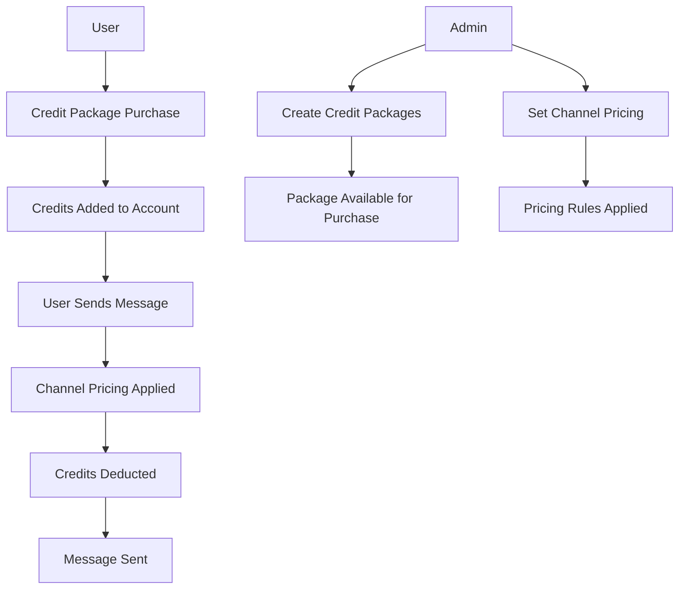

# Marketing Systems Documentation

## Overview

This directory contains comprehensive documentation for the Marketing Systems in the Taearif platform. The marketing systems consist of two main components: **Credit Packages** and **Marketing Channel Pricing**, which work together to provide a complete credit-based marketing solution.

## Documentation Structure

### 📁 Files in this Directory

| File                                  | Description                         | Purpose               |
| ------------------------------------- | ----------------------------------- | --------------------- |
| `README.md`                           | This file - Overview and navigation | Quick start guide     |
| `CREDIT_PACKAGES_SYSTEM.md`           | Credit Packages documentation       | Complete system guide |
| `MARKETING_CHANNEL_PRICING_SYSTEM.md` | Channel Pricing documentation       | Complete system guide |
| `MARKETING_SYSTEMS_POSTMAN_GUIDE.md`  | API testing guide                   | Postman collections   |

## System Components

### 🎯 Credit Packages System

**Purpose**: Manages credit bundles that users can purchase for various services.

**Key Features**:

- Create and manage credit packages
- Set pricing, discounts, and promotional offers
- Enable marketing channel support
- Calculate cost per credit automatically
- Provide message estimates per channel

**Documentation**: [`CREDIT_PACKAGES_SYSTEM.md`](./CREDIT_PACKAGES_SYSTEM.md)

### 📊 Marketing Channel Pricing System

**Purpose**: Manages credit consumption rates for different marketing channels.

**Key Features**:

- Set credits per message for each channel
- Manage pricing for WhatsApp, Facebook, Telegram, Instagram, SMS
- Calculate effective message costs
- Provide pricing comparisons
- Sync with credit package pricing

**Documentation**: [`MARKETING_CHANNEL_PRICING_SYSTEM.md`](./MARKETING_CHANNEL_PRICING_SYSTEM.md)

### 🔧 API Testing Guide

**Purpose**: Comprehensive Postman collections for testing both systems.

**Key Features**:

- Complete CRUD operations for both systems
- Authentication and security testing
- Error handling scenarios
- Integration testing workflows
- Performance and load testing

**Documentation**: [`MARKETING_SYSTEMS_POSTMAN_GUIDE.md`](./MARKETING_SYSTEMS_POSTMAN_GUIDE.md)

## Quick Start Guide

### For Developers

1. **Read the System Documentation**: Start with the individual system docs to understand architecture
2. **Set Up Postman**: Import the collections from the Postman guide
3. **Test the APIs**: Use the provided test scenarios
4. **Understand Integration**: Learn how the systems work together

### For Administrators

1. **Credit Packages**: Learn how to create and manage credit packages
2. **Channel Pricing**: Understand how to set up channel pricing
3. **Integration**: See how packages and pricing work together
4. **Analytics**: Use the comparison and estimation features

### For QA/Testing

1. **Import Collections**: Use the Postman collections for testing
2. **Run Test Scenarios**: Follow the provided testing workflows
3. **Validate Integration**: Test the interaction between systems
4. **Performance Testing**: Use the performance testing guidelines

## System Integration

### How They Work Together



### Key Integration Points

1. **Package Creation**: Admin creates packages with marketing support
2. **Pricing Setup**: Admin sets channel pricing rules
3. **User Purchase**: User buys credit package
4. **Message Sending**: System applies channel pricing to deduct credits
5. **Analytics**: System provides estimates and comparisons

## API Endpoints Summary

### Credit Packages

- `GET /admin/credit-packages` - List packages
- `POST /admin/credit-packages` - Create package
- `GET /admin/credit-packages/{id}` - View package
- `PUT /admin/credit-packages/{id}` - Update package
- `DELETE /admin/credit-packages/{id}` - Delete package
- `PATCH /admin/credit-packages/{id}/toggle-status` - Toggle status
- `PATCH /admin/credit-packages/{id}/toggle-marketing-support` - Toggle marketing support

### Marketing Channel Pricing

- `GET /admin/marketing-channel-pricing` - List pricing
- `POST /admin/marketing-channel-pricing` - Create pricing
- `GET /admin/marketing-channel-pricing/{id}` - View pricing
- `PUT /admin/marketing-channel-pricing/{id}` - Update pricing
- `DELETE /admin/marketing-channel-pricing/{id}` - Delete pricing
- `PATCH /admin/marketing-channel-pricing/{id}/toggle-status` - Toggle status
- `POST /admin/marketing-channel-pricing/bulk-update` - Bulk update
- `GET /admin/marketing-channel-pricing/comparison` - Pricing comparison

## Database Schema

### Credit Packages Table

```sql
CREATE TABLE credit_packages (
    id BIGINT PRIMARY KEY AUTO_INCREMENT,
    name VARCHAR(255) NOT NULL,
    name_ar VARCHAR(255),
    description TEXT,
    description_ar TEXT,
    credits INT NOT NULL,
    price DECIMAL(10,2) NOT NULL,
    currency VARCHAR(3) NOT NULL,
    discount_percentage DECIMAL(5,2),
    is_popular BOOLEAN DEFAULT FALSE,
    is_active BOOLEAN DEFAULT TRUE,
    sort_order INT DEFAULT 0,
    supports_marketing_channels BOOLEAN DEFAULT FALSE,
    marketing_priority INT DEFAULT 0,
    features JSON,
    marketing_features JSON,
    created_at TIMESTAMP,
    updated_at TIMESTAMP
);
```

### Marketing Channel Pricing Table

```sql
CREATE TABLE marketing_channel_pricing (
    id BIGINT PRIMARY KEY AUTO_INCREMENT,
    channel_type VARCHAR(50) NOT NULL UNIQUE,
    credits_per_message INT NOT NULL,
    price_per_credit DECIMAL(8,4) NOT NULL,
    effective_price_per_message DECIMAL(8,4) NOT NULL,
    currency VARCHAR(3) NOT NULL,
    is_active BOOLEAN DEFAULT TRUE,
    description TEXT,
    description_ar TEXT,
    channel_specific_settings JSON,
    created_at TIMESTAMP,
    updated_at TIMESTAMP
);
```

## Business Logic Examples

### Credit Package Pricing

```php
// Example: 1000 credits for 50 SAR with 20% discount
$package = new CreditPackage([
    'credits' => 1000,
    'price' => 50.00,
    'discount_percentage' => 20,
    'currency' => 'SAR'
]);

$pricePerCredit = $package->price_per_credit; // 0.04 SAR (after discount)
$discountedPrice = $package->discounted_price; // 40.00 SAR
$savings = $package->savings_amount; // 10.00 SAR
```

### Channel Pricing Calculation

```php
// Example: WhatsApp message costs 2 credits at 0.05 SAR per credit
$pricing = new MarketingChannelPricing([
    'channel_type' => 'whatsapp',
    'credits_per_message' => 2,
    'price_per_credit' => 0.05,
    'currency' => 'SAR'
]);

$effectivePrice = $pricing->effective_price_per_message; // 0.10 SAR
```

### Message Estimates

```php
// Calculate how many messages a package can send
$package = CreditPackage::find(1); // 1000 credits
$estimates = $package->getEstimatedMessagesPerChannel();

// Result:
// [
//     'whatsapp' => ['estimated_messages' => 500, 'credits_per_message' => 2],
//     'sms' => ['estimated_messages' => 1000, 'credits_per_message' => 1]
// ]
```

## Security Considerations

### Authentication

- Admin authentication required for all operations
- Session-based authentication with CSRF protection
- Permission-based access control

### Validation

- Comprehensive input validation
- SQL injection prevention
- XSS protection
- Data sanitization

### Data Protection

- Sensitive data encryption
- Secure API endpoints
- Rate limiting
- Audit logging

## Performance Optimization

### Database

- Indexed fields for fast queries
- Efficient pagination
- Optimized relationships
- Query caching

### Application

- Model caching
- Response caching
- Lazy loading
- Background processing

## Monitoring and Analytics

### Key Metrics

- Package sales statistics
- Channel usage patterns
- Revenue per package
- Credit consumption rates
- User conversion rates

### Logging

- System events logging
- Error tracking
- Performance monitoring
- Security audit trails

## Troubleshooting

### Common Issues

1. **Package Creation Fails**: Check validation rules and required fields
2. **Pricing Not Applied**: Verify channel pricing is active
3. **Message Estimates Wrong**: Check credits per message values
4. **Integration Issues**: Verify marketing support is enabled

### Debug Steps

1. Check database constraints
2. Verify model relationships
3. Review validation rules
4. Check error logs
5. Test with Postman collections

## Future Enhancements

### Planned Features

- Dynamic pricing adjustments
- Volume-based discounts
- Regional pricing
- A/B testing tools
- Advanced analytics
- Mobile app integration
- Multi-currency support
- Subscription packages

### Integration Opportunities

- Payment gateway integration
- CRM system integration
- Analytics platform integration
- Third-party API integration
- Email marketing integration

## Support and Maintenance

### Documentation Updates

- Keep documentation current with code changes
- Update API examples when endpoints change
- Maintain Postman collections
- Update troubleshooting guides

### Regular Maintenance

- Monitor system performance
- Review security logs
- Update dependencies
- Backup data regularly
- Test integrations

---

## Getting Help

### Documentation

- Read the individual system documentation files
- Check the Postman guide for API testing
- Review the troubleshooting section

### Development

- Check the code comments and inline documentation
- Review the model methods and relationships
- Test with the provided Postman collections

### Support

- Check error logs for detailed error messages
- Use the debugging steps provided
- Test with the provided scenarios

---

_This documentation is maintained alongside the codebase. Please update it when making changes to the marketing systems._
